# Governed Financials Agent

This project implements the Financials Agent for the API World session **Vertical APIs for Agentic AI: Routing the Right Context to the Right Expert**.

The agent answers bounded questions about public companies by combining:

- Quarterly SEC filing text retrieved from an OpenSearch vector index.
- Current company and market data retrieved from Finnhub through MCP 2.0 Streamable HTTP.
- Nemotron Orchestrator for constrained planning and advisory release verification.
- Qwen2.5-7B-Instruct for evidence-grounded synthesis and one bounded correction attempt.
- A2A 1.0 JSON-RPC served through the SDK HTTP-server routes for compatibility with the host orchestrator.
- Deterministic governance checks and a hash-chained audit log.

The project implements the Financials Agent only. It does not add a News Agent, Tavily integration, or host-orchestrator behavior.

## Architecture

```mermaid
flowchart LR
    H[Host Orchestrator] -->|A2A 1.0 JSON-RPC| A[Financial Agent :9002]
    Q[query.py A2A client] --> A

    A --> P[Deterministic scope, identity, source, and risk policy]
    P --> N[Nemotron Orchestrator :8002]
    N --> C[Constrained execution plan]

    C --> R[Symbol-filtered SEC filing RAG]
    R --> O[(OpenSearch :9200)]

    C --> MC[MCP 2.0 client]
    MC --> MS[Finnhub MCP :8766/mcp]
    MS --> FH[Finnhub API]

    O --> E[Approved evidence set]
    FH --> E
    E --> W[Qwen2.5-7B-Instruct :8001]
    W --> V[Deterministic verifier]
    V --> NV[Nemotron advisory verifier :8002]
    NV -->|approved| OUT[Grounded answer with citations]
    NV -->|rejected| RETRY[One bounded Qwen retry]
    RETRY --> V
    V -->|second rejection| HOLD[Withheld response]

    OUT --> AUDIT[(Hash-chained audit JSONL)]
    HOLD --> AUDIT
```



## Authority boundary

The Financials Agent may use only:

1. The financial-filings OpenSearch index.
2. The allowlisted Finnhub MCP tools.
3. Nemotron for constrained planning and advisory verification.
4. Qwen for synthesis from the approved evidence set.

With the default policy checks enabled, requests outside the financial domain are
rejected before retrieval, MCP, or model calls. Policy enforcement may be disabled
for diagnostics, but data access remains limited to the filing index and allowlisted
Finnhub tools. The agent still requires a usable company or ticker and does not
substitute a similarly named security.

## Governance controls

| Control | Behavior |
|---|---|
| Deterministic routing first | Domain, company identity, source classes, and risk are evaluated before Nemotron runs. Policy enforcement of that classification is configurable. |
| Constrained planning | With policy checks enabled, Nemotron may refine only the deterministic plan. In relaxed mode, its plan is merged permissively while MCP calls remain allowlisted. |
| Exact issuer matching | Company names must resolve conservatively through Finnhub search and profile data. |
| Corpus isolation | Every filing vector search contains an exact validated `symbol` filter. |
| Source-specific evidence identifiers | Filing evidence uses request-local `F1`, `F2`, ... identifiers. Finnhub MCP evidence uses request-local `M1`, `M2`, ... identifiers. |
| Citation enforcement | With evidence checks enabled, a response must use at least one approved `F#` or `M#` identifier and may not cite unknown or incorrectly namespaced evidence. The application builds `## Sources` from cited identifiers. |
| Investment-language policy | With policy checks enabled, personalized buy or sell advice, guaranteed outcomes, price targets, and cross-domain leakage are rejected. |
| Bounded retry | A response rejected by an enabled check receives one Qwen correction attempt. A second rejection is withheld. |
| Data-minimized audit | Audit records store hashes and metadata rather than raw queries, answers, evidence bodies, session IDs, or MCP argument values. |
| Tamper evidence | Every JSONL record includes the previous record hash. A damaged chain blocks later appends. |

### Governance check switches

| Environment variable | Default | Controls |
|---|---:|---|
| `RELEASE_CHECKS_ENABLED` | `true` | Required release formatting and Audit ID validation, plus the advisory Nemotron release-verifier call. |
| `POLICY_CHECKS_ENABLED` | `true` | Financial-domain rejection, strict model-plan constraints, and investment/cross-domain output patterns. |
| `EVIDENCE_CHECKS_ENABLED` | `true` | Required source availability, `F#`/`M#` namespaces, valid inline citations, and citation-to-source consistency. |

The switches accept `true`, `false`, `1`, `0`, `yes`, `no`, `on`, and `off`.
Disabling a check does not add retrieval systems or MCP tools; the filing index and
Finnhub allowlist remain the only financial data paths.

## A2A contract

The service exposes only A2A protocol version `1.0`:

- Agent name: `Financial Agent`
- Skill ID: `financial_search`
- Default port: `9002`
- JSON-RPC endpoint: `/`
- Current agent card: `/.well-known/agent-card.json`
- Protocol binding: `JSONRPC`
- Protocol version: `1.0`

The legacy `/.well-known/agent.json` document and A2A v0.3 compatibility route are not served. The A2A routes run in a Starlette ASGI application supplied by `a2a-sdk[http-server]`. The non-A2A `/health` endpoint is implemented in Flask and mounted behind Starlette through `a2wsgi` on the same service port.

## MCP contract

The Finnhub server uses official MCP 2.0 Streamable HTTP only:

```text
http://127.0.0.1:8766/mcp
```

Allowlisted tools:

- `resolve_public_symbol`
- `get_company_profile`
- `get_stock_quote`
- `get_company_metrics`
- `get_recent_quarterly_earnings`
- `get_earnings_calendar`

No custom stdio or SSE transport is implemented.

## Project layout

```text
.
├── query.py                          # Top-level A2A 1.0 client entry point
├── requirements.txt
├── requirements-dev.txt
├── Makefile
├── src/
│   ├── ingest.py                     # SEC filing ingestion and chunking
│   ├── query.py                      # A2A 1.0 client implementation
│   ├── common/
│   │   ├── config.py                 # Environment-backed settings
│   │   ├── embeddings.py             # Embedding model wrapper
│   │   ├── logging.py
│   │   └── opensearch_client.py      # Index mapping and filtered k-NN search
│   └── financials_agent/
│       ├── __main__.py               # Starlette A2A server plus Flask health endpoint
│       ├── financials_agent.py       # Governed execution pipeline
│       ├── financials_executor.py    # A2A executor
│       ├── planner.py                # Deterministic and constrained planning
│       ├── retrieval.py              # Symbol-filtered filing retrieval
│       ├── finnhub.py                # Typed Finnhub adapter
│       ├── finnhub_server.py         # MCP Streamable HTTP server
│       ├── mcp_client.py             # Official MCP client
│       ├── governance.py             # Deterministic release checks
│       ├── prompts.py                # Planner, synthesis, and verifier prompts
│       ├── llm_client.py             # Nemotron and Qwen OpenAI-compatible clients
│       ├── audit.py                  # Hash-chained audit writer and verifier
│       └── models.py                 # Internal contracts and trace records
└── tests/                            # Focused unit and protocol-contract tests
```

The project expects the separately supplied OpenAI-compatible model service to expose Nemotron on port `8002` and Qwen on port `8001`. That model-service file was not present in the source archive represented by this repository.

## Prerequisites

- Python 3.10 or later.
- OpenSearch reachable at the configured endpoint.
- A Finnhub API key.
- Nemotron Orchestrator exposed through an OpenAI-compatible endpoint.
- Qwen2.5-7B-Instruct exposed through an OpenAI-compatible endpoint.

## Install

```bash
python -m venv .venv
source .venv/bin/activate
python -m pip install --upgrade pip
python -m pip install -r requirements.txt
cp .env.example .env
```

Set at least:

```dotenv
FINNHUB_API_KEY=your-key
OPENSEARCH_HOST=127.0.0.1
OPENSEARCH_PORT=9200
```

The protocol dependencies are pinned to:

```text
a2a-sdk[http-server]==1.1.2
a2wsgi==1.10.10
mcp==2.0.0
```

## Model endpoints

The default model configuration is:

```dotenv
ORCH_URL=http://127.0.0.1:8002/v1
ORCH_MODEL=nvidia/Nemotron-Orchestrator-8B
LLM_URL=http://127.0.0.1:8001/v1
LLM_MODEL=Qwen/Qwen2.5-7B-Instruct
```

Configuration names in `.env.example` match the `Settings` loader in `src/common/config.py`.

## Prepare and ingest SEC filings

The ingester recursively discovers `.txt` files under `data/financial-filings`. Each filing must resolve to a valid ticker from either a JSON sidecar or an uppercase ticker parent directory.

```text
data/financial-filings/
└── AAPL/
    ├── aapl-20250628.txt
    └── aapl-20250628.json
```

Example sidecar:

```json
{
  "title": "Apple Inc. Form 10-Q",
  "company": "Apple Inc.",
  "symbol": "AAPL",
  "filing_type": "10-Q",
  "filing_date": "2025-06-28",
  "fiscal_period": "2025-Q3",
  "accession_number": "SEC accession identifier",
  "source_url": "Original filing URL"
}
```

Supported sidecar names are `<filing>.json` and `<filing>.txt.json`.

Run ingestion:

```bash
make ingest
```

Or run it directly:

```bash
PYTHONPATH=src python -m src.ingest --data-dir ./data/financial-filings
```

Ingestion preserves these defaults:

- Recursive `.txt` discovery.
- `2048`-character chunks with `256` characters of overlap.
- Embedding batch size `32`.
- `Qwen/Qwen3-Embedding-0.6B` embeddings.
- Stable SHA-1 document identifiers based on source path and chunk index.
- Delete-by-source-path before re-ingestion.

## Start the Finnhub MCP server

```bash
make mcp
```

Equivalent command:

```bash
PYTHONPATH=src python -m financials_agent.finnhub_server
```

## Start the A2A Financial Agent

```bash
make agent
```

Equivalent command:

```bash
PYTHONPATH=src python -m financials_agent
```

Service endpoints:

```text
JSON-RPC:  http://127.0.0.1:9002/
Agent card: http://127.0.0.1:9002/.well-known/agent-card.json
Health:     http://127.0.0.1:9002/health
```

## Query through A2A 1.0

`query.py` does not instantiate `FinancialsAgent` in-process. It resolves the current agent card, requires exactly one JSON-RPC interface at protocol version `1.0`, creates the SDK client, sends the request over A2A, and reads the released answer from the task artifact.

```bash
python query.py -q \
  "What is AAPL's current stock price and what do recent filings say about Services revenue?"
```

Display client-side protocol metadata:

```bash
SHOW_TRACE=true python query.py -q \
  "Is Anthropic publicly traded?"
```

The trace includes the discovered agent name, protocol binding, protocol version, task ID, and terminal task state. It does not expose the internal governed execution trace.

## Boundary diagnostics

Set `LOG_LEVEL=DEBUG` on each process to log complete inputs and outputs at the
agent, OpenSearch retrieval, MCP client, MCP server, Finnhub REST, Nemotron, and
Qwen boundaries:

```bash
LOG_LEVEL=DEBUG make mcp
LOG_LEVEL=DEBUG make agent
LOG_LEVEL=DEBUG make client
```

`INFO` retains lifecycle summaries, selected tools, evidence counts, outcomes,
audit IDs, and latency. `DEBUG` includes raw questions, prompts, retrieved filing
text, market-data payloads, model responses, verification reasons, and released
or withheld answers. Finnhub API keys are not written by the application logger,
and the `httpx`/`httpcore` transport loggers are held at `WARNING` so they cannot
render credential-bearing Finnhub request URLs.
Use debug logging only in a development environment where those payloads may be
stored safely.

When a bounded retry is rejected, the withheld response now reports the bounded
verification reasons instead of replacing them with one generic diagnostic.
The complete structured result remains available in the agent logs and the
data-minimized audit metadata.

Before verification, the agent performs bounded formatting normalizations. It
moves a model-supplied citation-only line such as `[M1]` onto the immediately
preceding claim, renders `## Sources` from the claim citations and approved
evidence metadata, and replaces any model-written audit line with the
server-assigned audit ID. The source renderer supports filing `F#` and Finnhub
MCP `M#` identifiers in the same answer. It never invents a citation for an
uncited claim.

## Audit log

Default path:

```text
./var/financials-audit.jsonl
```

Verify the full hash chain:

```bash
make audit
```

The raw query, evidence bodies, generated answer, session ID, and MCP argument values are not written to the audit file.

## Tests

Install development dependencies and run:

```bash
python -m pip install -r requirements-dev.txt
make test
```

The focused suite verifies:

- String and alias forms of an affirmative advisory-verifier JSON result.
- Malformed advisory approval values cannot veto a deterministic pass.
- Advisory verifier concerns are recorded but cannot veto a deterministic pass.
- Malformed or unavailable advisory verification is recorded as a warning.
- A current quote is released when approved evidence and citations pass.
- Standalone model-supplied citations are normalized onto the claim they follow.
- Market `M#` and filing `F#` evidence identifiers remain separate and valid.
- Missing source-list entries are rendered deterministically from cited approved evidence.
- A combined quarterly-performance and current-price request retrieves filing and Finnhub evidence concurrently and releases both citation namespaces.
- The bounded retry receives the rejected answer as well as the verifier reasons.
- Company-symbol resolution alone cannot satisfy a quote, earnings, metrics, or filing request.
- Final withholding responses expose bounded verifier reasons after the correction attempt.

The tests use injected doubles and do not call OpenSearch, Finnhub, local models, or a live A2A server.

## Operational notes

- Start OpenSearch, both model endpoints, and the MCP server before starting the full agent workflow.
- Filing-only requests may complete without a Finnhub market tool.
- Market-only requests do not initialize the embedding model or OpenSearch retrieval path.
- Requests for quarterly or financial performance use filing retrieval; a request that also asks for a current quote runs filing and Finnhub retrieval concurrently.
- Planner failure falls back to deterministic routing.
- A failed source is recorded as a warning. A partial-source answer may be released only when citation and policy checks pass.
- This service returns evidence-grounded financial information and does not provide personalized investment advice.
